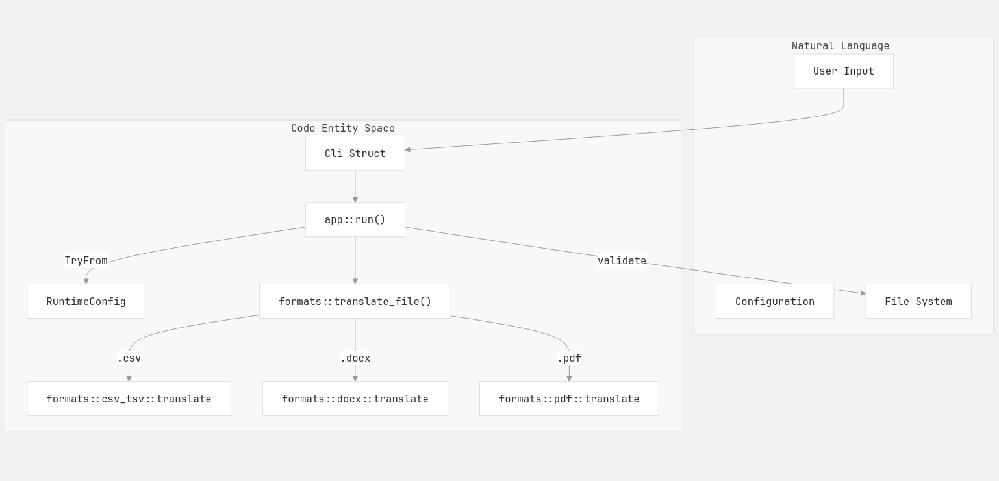

# TMT File Translation Tool
[](https://deepwiki.com/razzat008/collaboratex)
or read more at [https://hail-translation.rajatdahal.com.np/](http://hail-translation.rajatdahal.com.np/)

A high-performance CLI utility for translating structured documents between multiple languages using the TMT Translation API.

Supported formats:

- PDF
- DOCX
- CSV
- TSV

Supported languages:

- English (`en`)
- Nepali (`ne`)
- Tamang (`tmg`)

The tool preserves document structure and formatting while translating textual content.

---

# Features

- Multi-format document translation
- Concurrent API request processing
- Retry and rate-limiting support
- PDF reconstruction with custom font support
- Structured logging and debugging
- Runtime validation for safer execution
- Modular architecture for easy extensibility

---

# Table of Contents

<details>
<summary>Click to expand</summary>

- [Features](#features)
- [Installation](#installation)
  - [Prerequisites](#prerequisites)
  - [Optional Native Dependencies (PDF Support)](#optional-native-dependencies-pdf-support)

- [Building](#building)
  - [Standard Build](#standard-build)
  - [Build with PDF Support](#build-with-pdf-support)

- [Usage](#usage)
  - [Basic Syntax](#basic-syntax)

- [Command Reference](#command-reference)
  - [Required Arguments](#required-arguments)
  - [Optional Arguments](#optional-arguments)

- [Examples](#examples)

- [Configuration](#configuration)
  - [Environment Variables](#environment-variables)
  - [Validation Rules](#validation-rules)

- [Supported Language Codes and File Formats](#supported-language-codes-and-file-formats)

- [System Architecture](#system-architecture)
  - [Architecture Overview](#architecture-overview)
  - [Core Components](#core-components)
  - [Architecture Flow](#architecture-flow)

- [Project Structure](#project-structure)

- [Development Notes](#development-notes)

- [Feature Flags](#feature-flags)
  - [PDF Support](#pdf-support)

- [Limits](#limits)

- [Troubleshooting](#troubleshooting)

</details>

---

# Installation

## Prerequisites

### Rust Toolchain

Install Rust (Edition 2024 compatible):

```bash
curl --proto '=https' --tlsv1.2 -sSf https://sh.rustup.rs | sh
```

Verify installation:

```bash
rustc --version
cargo --version
```

---

## Optional Native Dependencies (PDF Support)

PDF support requires additional native libraries.

### Linux

Install:

```bash
sudo apt install libfreetype6-dev
```

You may also need:

- PDFium
- fontconfig
- freetype

depending on your distribution.

---

# Building

## Standard Build

Build without PDF support:

```bash
cargo build --release
```

Binary output:

```bash
./target/release/hackathon
```

---

## Build with PDF Support

Enable the `pdf` feature:

```bash
cargo build --release --features pdf
```

---

# Usage

## Basic Syntax

```bash
./target/release/hackathon \
  --input <file> \
  --output <file> \
  --src-lang <code> \
  --tgt-lang <code>
```

---

# Command Reference

## Required Arguments

| Argument | Short | Description |
|---|---|---|
| `--input` | `-i` | Input file path |
| `--output` | `-o` | Output file path |
| `--src-lang` | `-s` | Source language |
| `--tgt-lang` | `-t` | Target language |

---

## Optional Arguments

| Argument | Default | Description |
|---|---|---|
| `--base-url` | TMT API URL | Translation API endpoint |
| `--api-token` | None | API token |
| `--concurrency` | `2` | Maximum concurrent requests |
| `--rate-limit-ms` | None | Delay between requests |
| `--max-retries` | `4` | Retry count |
| `--font-path` | None | Font path for PDF rendering |
| `--dpi` | `96` | PDF rendering DPI |
| `--jpeg-quality` | `85` | PDF image quality |
| `--verbose` | `false` | Enable verbose logs |
| `--debug-bboxes` | `false` | Draw PDF debug boxes |

---

# Examples


```bash
# CSV Translation
./target/release/hackathon \
  --input users.csv \
  --output users_ne.csv \
  -s en \
  -t ne
```

```bash
# DOCX Translation
./target/release/hackathon \
  --input report.docx \
  --output report_tmg.docx \
  -s en \
  -t tmg \
  --concurrency 4
```


```bash
# PDF Translation
./target/release/hackathon \
  --input manual.pdf \
  --output manual_ne.pdf \
  -s en \
  -t ne \
  --font-path ./fonts/NotoSansDevanagari.ttf \
  --dpi 150 \
  --jpeg-quality 90
```


```bash
# Enable Verbose Logging
./target/release/hackathon \
  --input data.csv \
  --output translated.csv \
  -s en \
  -t ne \
  --verbose
```

---

# Configuration

## Environment Variables

You can provide the API token through environment variables.

```bash
export TMT_API_TOKEN="your_api_token"
```

---

# Validation Rules

The runtime validates:

- API token existence
- `concurrency >= 1`
- `max-retries >= 1`
- source and target languages must differ
- `dpi >= 1`
- JPEG quality between `1-100`
- font path existence and validity

---

# Supported Language Codes and File Formats

| Language | Code | 
|---|---|
| English | `en` |
| Nepali | `ne` |
| Tamang | `tmg` |

| Format | Supported |
|---|---|
| PDF | Yes |
| DOCX | Yes |
| CSV | Yes |
| TSV | Yes |

---

# System Architecture



The application follows a modular layered architecture.

## Architecture Overview

```text
┌──────────────────────────────────────────────────────────────┐
│                     CLI Entry Point                          │
│                     (src/main.rs)                            │
│  - Parse CLI args with clap                                  │
│  - Initialize logging (tracing)                              │
│  - Call app::run()                                           │
└────────────────────────┬─────────────────────────────────────┘
                         │
                         ▼
        ┌────────────────────────────────────┐
        │   RuntimeConfig Validation         │
        │   (src/config.rs)                  │
        │  - Validate all CLI arguments      │
        │  - Load API token from env/CLI     │
        │  - Enforce constraints             │
        └────────────────┬───────────────────┘
                         │
                         ▼
        ┌────────────────────────────────────┐
        │   File Validation (src/app.rs)     │
        │  - Input file exists & is file     │
        │  - Check file size (<1MB)          │
        │  - Validate format consistency     │
        │  - Create output parent dirs       │
        └────────────────┬───────────────────┘
                         │
                         ▼
        ┌────────────────────────────────────┐
        │   Format Dispatcher                │
        │   (src/formats/mod.rs)             │
        │  - Create TmtClient                │
        │  - Create TranslationService       │
        │  - Route to format-specific        │
        │    handler (CSV/TSV/PDF/DOCX)      │
        └────────────────┬───────────────────┘
                         │
          ┌──────────────┼──────────────┬─────────────┐
          │              │              │             │
          ▼              ▼              ▼             ▼
    ┌─────────────┐ ┌─────────────┐ ┌─────────┐ ┌──────────┐
    │   CSV/TSV   │ │     PDF     │ │  DOCX   │ │Sentence  │
    │   Handler   │ │  Pipeline   │ │Handler  │ │ Splitter │
    │(csv_tsv.rs) │ │(pdf/mod.rs) │ │(docx.rs)│ │(service) │
    └──────┬──────┘ └──────┬──────┘ └────┬────┘ └──────────┘
           │               │             │
           └───────────────┴─────────────┘
                          │
                          ▼
        ┌────────────────────────────────────┐
        │    TranslationService              │
        │    (src/translate/service.rs)      │
        │  - Concurrent request management   │
        │  - Caching (sentence-level)        │
        │  - In-flight deduplication         │
        │  - Sentence splitting              │
        └────────────────┬───────────────────┘
                         │
                         ▼
        ┌────────────────────────────────────┐
        │         TmtClient                  │
        │      (src/tmt/client.rs)           │
        │  - HTTP requests to TMT API        │
        │  - Retry logic (429 + transient)   │
        │  - Rate-limit enforcement          │
        │  - Backoff strategy                │
        └────────────────┬───────────────────┘
                         │
                         ▼
        ┌────────────────────────────────────┐
        │    TMT API (External Service)      │
        │  POST /lang-translate              │
        │  Returns: { "result": <text> }     │
        └────────────────────────────────────┘
```

---

## Core Components

| Component | Responsibility |
|---|---|
| **CLI Layer** | Parses arguments, runtime flags, and user inputs using `clap` |
| **Configuration Layer** | Loads environment variables, validates runtime configuration, and applies defaults |
| **Translation Service** | Handles API communication, retries, batching, concurrency, and rate limiting |
| **Format Handlers** | Extracts and reconstructs content for PDF, DOCX, CSV, and TSV formats |
| **Reconstruction Layer** | Rebuilds translated documents while preserving formatting and layout |

---

## Architecture Flow

```text
CLI → Config Validation → Translation Service → Format Handler → Reconstruction
```

---

# Project Structure

```text
src/
├── app.rs
├── cli.rs
├── config.rs
├── error.rs
├── lib.rs
├── logging.rs
├── main.rs
│
├── formats/
│   ├── csv_tsv.rs
│   ├── docx.rs
│   └── pdf/
│       ├── parser.rs
│       ├── translator.rs
│       ├── renderer.rs
│       ├── reconstructor.rs
│       ├── fonts.rs
│       ├── bundled_fonts.rs
│       ├── types.rs
│       ├── utils.rs
│       └── error.rs
│
├── tmt/
│   ├── client.rs
│   ├── backoff.rs
│   └── mod.rs
│
└── translate/
    ├── service.rs
    ├── sentence.rs
    └── mod.rs
```

---

# Development Notes

- Structured logging powered by `tracing` and `tracing-subscriber`
- PDF support is optional and enabled through the `pdf` feature flag
- Runtime validation prevents invalid translation configurations

---

# Feature Flags

## PDF Support

```bash
cargo build --release --features pdf
```

Enables:

- PDF parsing
- font rendering
- image reconstruction
- PDF translation pipeline

---

# Limits

| Constraint | Value |
|---|---|
| Max file size | 1 MB |
| Max request text size | 5000 bytes |

---

# Troubleshooting

| Issue | Fix |
|---|---|
| Missing API Token | `export TMT_API_TOKEN=your_token` |
| PDF Font Issues | `--font-path ./assets/fonts/NotoSansDevanagari.ttf` |
| Invalid JPEG Quality | Allowed range: `1-100` |
